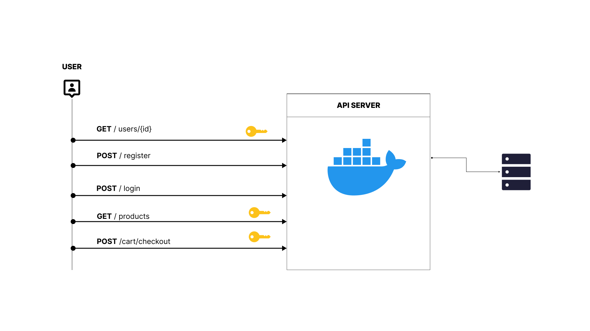

Here is a README file for the project you described:

# Production-Ready E-commerce REST API in Go

## Overview
This project aims to build a production-ready E-commerce REST API in Go. I'll be utilizing JWT authentication, testing our services, and connecting our server to a MySQL database.

## Features
- JWT-based authentication
- CRUD operations for e-commerce products, orders, and users
- Integration with a MySQL database
- Comprehensive test suite

## Technologies Used
- Go programming language
- JWT for authentication
- MySQL database
- Go testing framework

## System Architecture

### Prerequisites
- Go 1.16 or later installed
- MySQL database setup

## License
This project is licensed under the [MIT License](LICENSE).